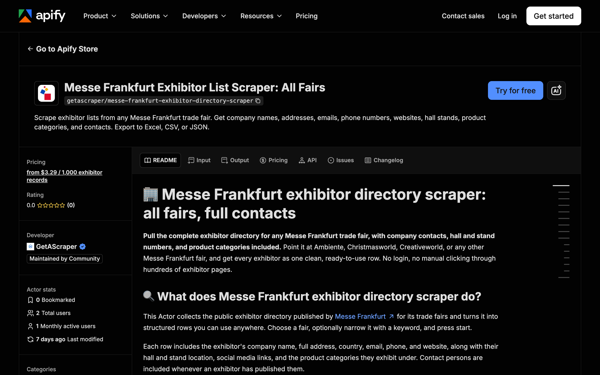

<div align="center">

# Messe Frankfurt Scraper: Exhibitor Lists

[](https://apify.com/getascraper/messe-frankfurt-exhibitor-directory-scraper)
[](https://apify.com/getascraper/messe-frankfurt-exhibitor-directory-scraper)
[](https://apify.com/getascraper/messe-frankfurt-exhibitor-directory-scraper)
[](https://github.com/getascraper/how-to-scrape-messe-frankfurt/issues)
[](https://github.com/getascraper/how-to-scrape-messe-frankfurt/commits/main)

Scrape exhibitor lists from any Messe Frankfurt trade fair. Get company names, addresses, emails, phone numbers, websites, hall stands, product categories, and contacts. Export to Excel, CSV, or JSON.

[](https://apify.com/getascraper/messe-frankfurt-exhibitor-directory-scraper)

</div>

---

## Why use Messe Frankfurt Scraper

* **Complete exhibitor lists**: pull every exhibitor for a fair like Ambiente, Christmasworld, or Creativeworld in a single run.
* **Ready contact details**: get company emails, phone numbers, and websites whenever the exhibitor has published them.
* **Hall and stand numbers included**: know exactly where each exhibitor is located on the show floor.
* **Product category filtering**: narrow results to the categories or keywords that matter to your search.
* **Clean flat exports**: every row opens cleanly in Excel, Google Sheets, or your own database, no cleanup required.

---

## How to use Messe Frankfurt Scraper

1. Enter the **fair event code**, such as `AMBIENTE`, `CHRISTMASWORLD`, or `CREATIVEWORLD`.
2. Optionally add a **search query** to narrow the list to a keyword, company, or product.
3. Click **Start**: The actor collects every matching record and writes one flat row per item.
4. **Download your results**: Export as Excel, CSV, JSON, or HTML from the Output tab.

---

## Input

| Field | Type | Required | Description |
| --- | --- | :---: | --- |
| `fairEventCode` | string | No | The fair's short code in capital letters, e.g. `AMBIENTE`, `CHRISTMASWORLD`, `CREATIVEWORLD`. Defaults to `AMBIENTE`. |
| `searchQuery` | string | No | Keyword to filter exhibitors by company name, product, or brand. Leave empty to list every exhibitor. |
| `maxItems` | integer | No | Maximum number of exhibitor records to return. Use 0 for no limit. |
| `proxyConfiguration` | object | No | Not required for this fair directory. Left off by default. |

---

## Output

Each row in your dataset is one exhibitor. All fields are flat with no nested data, so the file opens cleanly in any spreadsheet program.

```json
{
  "companyName": "Budapest Select",
  "companyAddress": "Istenhegyi ut 18, 1126, Budapest",
  "companyCountry": "Hungary",
  "companyEmail": "info@chungary.com",
  "companyPhone": "+36 30 323 8346",
  "companyWebsite": "https://chungary.com/",
  "hallStands": "Hall 3.0, Stand G32",
  "socialLinks": [
    "linkedin: https://www.linkedin.com/company/creativehungary/",
    "facebook: https://www.facebook.com/creativehungary",
    "instagram: https://www.instagram.com/creativehungary/#"
  ],
  "productCategories": ["Designer home concepts", "Luminaires"],
  "fairName": "Ambiente 2026",
  "fairStartDate": "2026-02-06",
  "fairEndDate": "2026-02-10",
  "scrapedAt": "2026-07-03T02:51:51.874Z"
}
```

### Data table

| Field | Type | Description |
| --- | :---: | --- |
| `companyName` | string | Exhibitor's company name. |
| `companyAddress` | string | Full street address, postal code, and city. |
| `companyCountry` | string | Country of the exhibitor. |
| `companyEmail` | string | Contact email, when published. |
| `companyPhone` | string | Contact phone number, when published. |
| `companyWebsite` | string | Exhibitor's website. |
| `hallStands` | string | Hall and stand number at the fair. |
| `socialLinks` | array | LinkedIn, Facebook, Instagram, and other profile links. |
| `contactPersons` | array | Named contacts with role and reach, when the exhibitor has published them. |
| `productCategories` | array | Product categories the exhibitor is listed under. |
| `fairEventCode` | string | The fair code used for this run. |
| `fairName` | string | Full fair name and year, e.g. "Ambiente 2026". |
| `fairStartDate` / `fairEndDate` | string | Fair dates. |
| `description` | string | Exhibitor's self-written company description, when published. |
| `exhibitorId` | string | Stable identifier for this exhibitor at this fair. |
| `scrapedAt` | string | Timestamp of the scrape, in ISO 8601 format. |

---

## Pricing

**$4.39 per 1,000 exhibitor records. The first 50 results of every run are completely free.** No monthly subscriptions and no minimum commits.

You only pay for the records you collect. A typical run of 100 exhibitors completes in under a minute.

---

## Quick start

Create a `.env` file from `.env.example`, add your [Apify API token](https://console.apify.com/account/integrations), and run:

```bash
npm install
npm start
```

The script uses the [Apify API client](https://docs.apify.com/api/client/js/) to start the actor and fetch results.

---

## Tips and optimization

* **Start small**: run 10 to 20 items first to preview the output shape before scaling to a full fair.
* **Use the exact fair code**: fair codes are the fair's display name in capital letters with spaces removed, e.g. `CHRISTMASWORLD`.
* **Narrow with a search query**: filter to a keyword, product, or brand to skip exhibitors you do not need.
* **Set Max items to control cost**: cap your run so you only pay for the exhibitors you actually want.

---

## FAQ

**Is scraping the Messe Frankfurt exhibitor directory legal?**
This actor collects only public data that anyone can view on Messe Frankfurt's website without logging in. Scraping public data is generally legal, but you are responsible for how you use the results.

**Do I need a Messe Frankfurt account or login?**
No. The actor needs no login and no account. Just choose a fair and press start.

**How do I find the right fair event code?**
Use the fair's public display name with spaces removed and letters capitalized, for example `CHRISTMASWORLD` for Christmasworld. If a code returns zero results, double check the spelling against the fair's official name.

**Why do some exhibitors have fewer fields than others?**
Not every exhibitor fills in every field on Messe Frankfurt's platform. This actor never fills in guesses. It only returns what the exhibitor actually published.

---

## Support

For bug reports, missing fields, or feature requests, open an issue under the [Issues](https://github.com/getascraper/how-to-scrape-messe-frankfurt/issues) tab, or visit the [Actor page on Apify](https://apify.com/getascraper/messe-frankfurt-exhibitor-directory-scraper).
